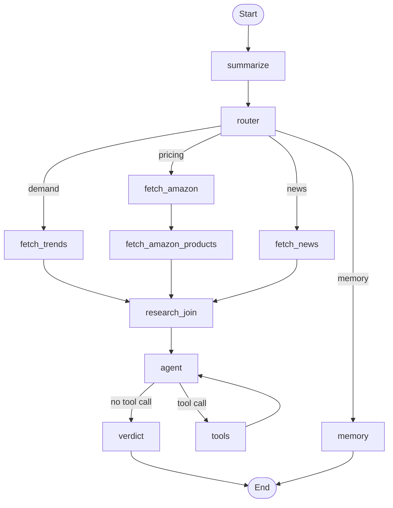

# LaunchLens

LaunchLens is a LangGraph-based market research assistant for founders. A user asks about a product or startup idea, and the graph routes the question, gathers external evidence, and returns a structured **GO / NICHE / NO-GO** verdict.

The assistant currently uses:

- **OpenAI** for routing, summarization, agent reasoning, and verdict generation.
- **SerpApi** for Google Trends and Google News signals.
- **Oxylabs** for Amazon marketplace research through `amazon_search` and product-detail enrichment through `amazon_product`.
- **LangGraph SQLite checkpointing** for short-term thread memory.

## Demo

https://youtu.be/WUktWB56tJ8

## LangGraph Architecture



## Project Structure

```text
Launch Lens/
+-- README.md
+-- pyproject.toml
+-- uv.lock
+-- src/
|   +-- backend/
|       +-- app.py              # FastAPI API used by the React dashboard
|       +-- api.py              # SerpApi + Oxylabs API functions and Pydantic result models
|       +-- config.py           # Configuration constants
|       +-- diagram.py          # LangGraph PNG diagram generation
|       +-- graph.py            # LangGraph topology and routing edges
|       +-- main.py             # CLI entry point
|       +-- nodes.py            # LangGraph node implementations
|       +-- state.py            # AgentState and route type definitions
|       +-- tools.py            # LangChain tools exposed to the agent
|       +-- graph_out/
|           +-- graph.png       # Generated architecture diagram
|-- frontend/
|   +-- index.html
|   +-- package.json
|   +-- vite.config.js
|   +-- src/
|       +-- main.jsx            # React dashboard
|       +-- styles.css          # Dashboard layout and visual styling

```

## Main LangGraph Concepts Used

### Routing

The `router_node` classifies each user question into one of these routes:

- `demand`: demand, trends, popularity, customer interest.
- `pricing`: Amazon pricing and competitor signals.
- `full_report`: broad market validation using multiple sources.
- `memory`: questions about previous conversation or checkpointed context.

The router also extracts:

- `search_query`: a clean product/category phrase for research.
- `target_region`: the launch market, such as `United Arab Emirates` or `India`.

### Fan-Out

For research questions, the graph fans out to the relevant data-source nodes:

- `fetch_trends`: Google Trends via SerpApi.
- `fetch_amazon`: Amazon marketplace listings via Oxylabs `amazon_search`.
- `fetch_amazon_products`: enriches top Amazon search ASINs via Oxylabs `amazon_product`.
- `fetch_news`: Google News via SerpApi.

For `full_report`, independent sources run in parallel where possible. Amazon product enrichment runs after Amazon search because it needs ASINs from the search result.

### Research Join

The graph uses a `research_join` node before the agent. This ensures the agent sees all scheduled research outputs, including the sequential Amazon product enrichment result.

### Summarization

The `summarize_node` keeps long conversations manageable. Once the message history crosses the configured threshold, older turns are compressed into `state["summary"]`, while recent messages remain available.

### Short-Term Memory

LaunchLens uses LangGraph's SQLite checkpointer for short-term memory. State is stored per `thread_id` in `checkpoints.db`.

Memory questions take the `memory` route:

```text
START -> summarize -> router -> memory -> END
```

This route does not call SerpApi, Oxylabs, tools, the agent, or the verdict node. It answers from checkpoint-restored state for the current thread.

### Agent And Tools

The `agent_node` is a tool-capable reasoning step. It receives the collected fan-out evidence and can call tools only when follow-up data is needed.

Available tools include:

- `trends_tool`
- `amazon_tool`
- `amazon_product_tool`
- `news_tool`

### Verdict

The `verdict_node` combines the collected evidence into a structured result:

```python
{
    "decision": "GO | NICHE | NO-GO",
    "confidence": "Low | Medium | High",
    "reasoning": "...",
    "key_factors": ["...", "...", "..."]
}
```

## External Data Providers

### SerpApi

SerpApi is used for:

- Google Trends demand signals.
- Google News market/context signals.

Region is passed through supported Google parameters where available.

### Oxylabs

Oxylabs is used for Amazon marketplace supply and competitor research:

- `amazon_search`: finds competing/similar products for the extracted `search_query`.
- `amazon_product`: enriches the top ASINs returned by `amazon_search`.


## Configuration

Create `src/backend/.env` with:

```env
OPENAI_API_KEY=...
OPENAI_MODEL=...
SERPAPI_API_KEY=...
OXYLABS_USERNAME=...
OXYLABS_PASSWORD=...
```

Optional:

```env
OXYLABS_AMAZON_DOMAIN=com
```

If `OXYLABS_AMAZON_DOMAIN` is not set, the app derives the Amazon domain from the target region, for example:

- `United States` -> `com`
- `India` -> `in`
- `United Arab Emirates` -> `ae`

## Running

### CLI

From the backend directory:

```powershell
cd "src/backend"
python main.py --thread default-thread --db checkpoints.db
```

Or from the project root:

```powershell
uv run python src/backend/main.py --thread default-thread --db src/backend/checkpoints.db
```

Use the same `thread_id` to continue a conversation and retrieve checkpointed memory.

### Local Web App

Run the FastAPI backend from the project root:

```powershell
uv run uvicorn src.backend.app:app --host 127.0.0.1 --port 8000
```

In a second terminal, run the React dashboard:

```powershell
cd frontend
npm install
npm run dev
```

Open:

```text
http://127.0.0.1:5173
```

The dashboard shows the route path at the top, the final verdict in the center, and the checkpointer, summarization, fan-out node results, agent output, token usage, and latency around it.

## Example Prompts

Full market research:

```text
Research launching vegan cosmetics in UAE
```

Pricing/competitor research:

```text
What price should eco-friendly lunch boxes have in India?
```

Memory:

```text
What products did you research earlier?
```
